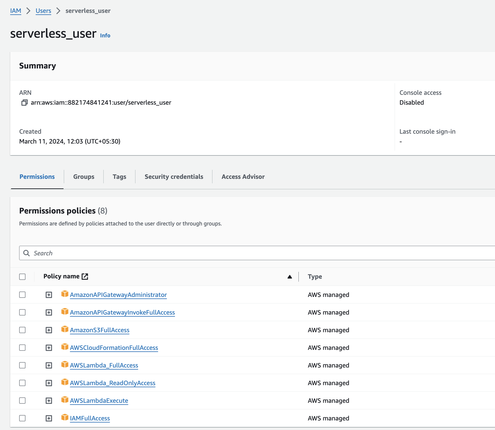

## Serverless

### Install serverless CLI
    $ brew install serverless

### Configure project
    $ mkdir serverless/node-http-api
    Add <function>.js into the node-http-api folder
    Add serverless.yml in the parent serverless folder

### Test the APIs locally
    $ serverless invoke local --function sayHelloFn
    $ serverless invoke local --function sayHelloFn

## Configure AWS IAM user for serverless deploy
    Create a serverless_user using IAM console
    Create and copy the access key
    Configure environment variables
    $ export AWS_ACCESS_KEY_ID=<enter access key here>
    $ export AWS_SECRET_ACCESS_KEY=<enter secret key here>

    Grant required policies:

## Deploy to AWS
    $ serverless deploy (or sls deploy)
        ✔ Service deployed to stack mfe-apis-dev (55s)

        endpoints:
        GET - https://0r7dt6xkt6.execute-api.ap-south-1.amazonaws.com/hello
        GET - https://0r7dt6xkt6.execute-api.ap-south-1.amazonaws.com/bye
        functions:
        sayHelloFn: mfe-apis-dev-sayHelloFn (716 B)
        sayByeFn: mfe-apis-dev-sayByeFn (716 B)

## Undeploy from AWS
    $ sls remove